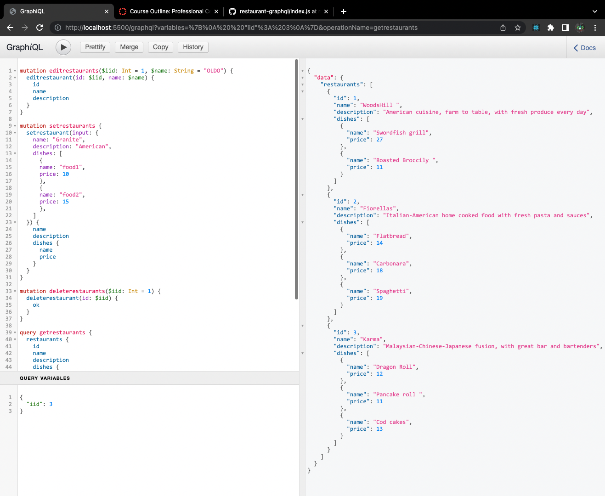

#   GraphQL Restaurant Data Exercise 

Creating multi-tier applications means building multiple API endpoints to handle different data operations. The more complex your application becomes, the harder it is to maintain all these endpoints. GraphQL aims to reduce this complexity by providing a simpler view of data and making it easier to query it. 

Your task is to set up GraphQL for your restaurant data and then add mutations to get and update these data. 

The starter files include the restaurant data in JSON format and a predefined build schema for GraphQL. You need to go through this code to understand what each query or mutation should look like.

To accomplish this task, you need to implement the following methods under the “root” object: 

- restaurant: This gets a single restaurant based on a provided ID. 
- restaurants: This gets a list of all restaurants. 
- setrestaurant: This creates a new restaurant. 
- deleterestaurant: This deletes a restaurant based on the provided id.
- editrestaurant: This updates a restaurant based on the provided id.

> Instructions:

After completing the task, run the GraphQL interface and submit a file with screenshots showing all five queries and mutations highlighted above, along with a link to your GitHub repo that houses the code for this activity.

> Screenshots
### Get Single Restaurant

### Get All Restaurants

### Set Restaurant

### Delete Restaurant

### Edit Restaurant

## MIT License

Copyright (c) 2022 Pete Chu  ***[codeByPete](https://www.codebypete.com/)***

Permission is hereby granted, free of charge, to any person obtaining a copy of this software and associated documentation files (the "Software"), to deal in the Software without restriction, including without limitation the rights to use, copy, modify, merge, publish, distribute, sublicense, and/or sell copies of the Software, and to permit persons to whom the Software is furnished to do so, subject to the following conditions:

The above copyright notice and this permission notice shall be included in all copies or substantial portions of the Software.

THE SOFTWARE IS PROVIDED "AS IS", WITHOUT WARRANTY OF ANY KIND, EXPRESS OR IMPLIED, INCLUDING BUT NOT LIMITED TO THE WARRANTIES OF MERCHANTABILITY FITNESS FOR A PARTICULAR PURPOSE AND NONINFRINGEMENT. IN NO EVENT SHALL THE AUTHORS OR COPYRIGHT HOLDERS BE LIABLE FOR ANY CLAIM, DAMAGES OR OTHER LIABILITY, WHETHER IN AN ACTION OF CONTRACT, TORT OR OTHERWISE, ARISING FROM, OUT OF OR IN CONNECTION WITH THE SOFTWARE OR THE USE OR OTHER DEALINGS IN THE SOFTWARE.